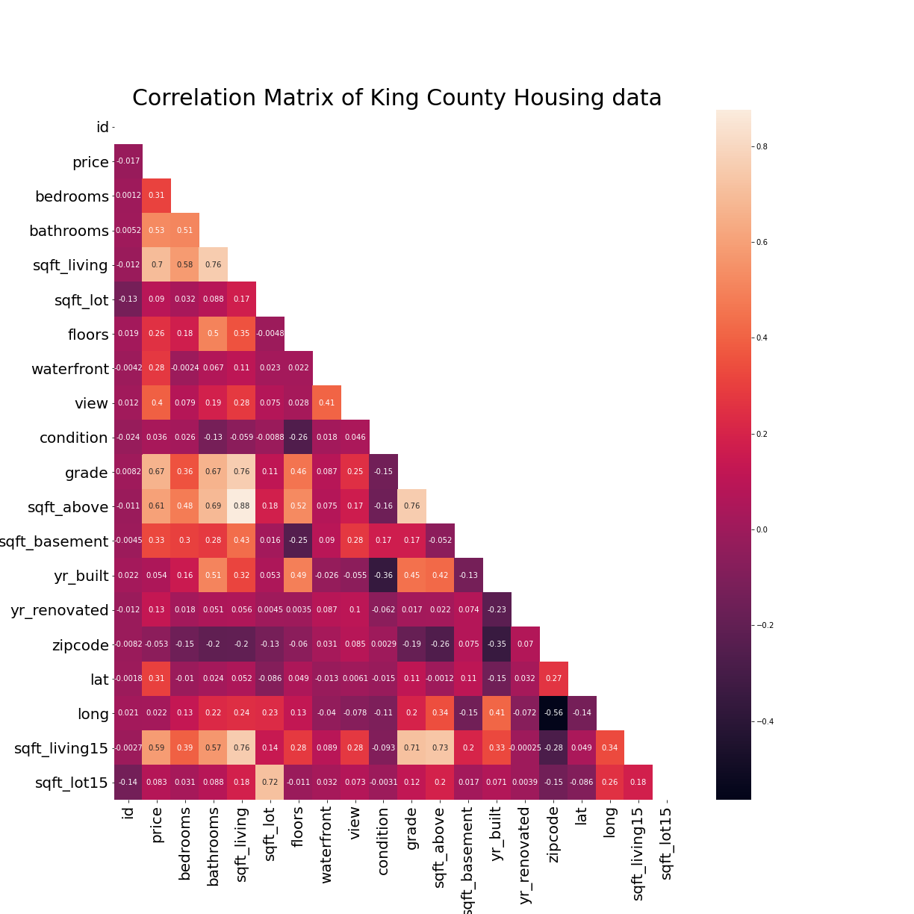

# Predicting King County Housing Prices

**Authors**: Adonis McQueen, Colin Pelzer, Zach Hanly

## Overview
This project takes the data for houses in King County Washington in order to predict home prices based upon various features. We use linear regression modeling on various features in order to predict these prices. 

## Business and Data Understanding
Ding Dong Real Estate wants to purchase homes in the Seattle area. They have tasked us with determining how much to spend on a home, on average, and areas to purchase homes in. 

Our data set contains information of houses sold such as price, square footage, grade of the house and the locations in both cooridinates and zipcode. This is all thanks to King County's effort to make data more accessible. 
From the King County site:
<blockquote cite="https://kingcounty.gov/about/website/Transparency.aspx">
"King County is committed to making data open, accessible and transparent. The following data resources are designed to increase public access to high value, machine readable datasets from various departments in King County government."</blockquote>

For more King County data go to [King County Public Data](https://kingcounty.gov/services/data.aspx)

## Explain your stakeholder audience here
The stakeholder for this project is a commercial real estate company looking to purchase homes in a given area. They are primarily interested in: what zipcodes have the lowest prices, predicted prices of homes in the area, and any relevant differences between the real prices and our model's predicted price.

## Modeling
### Correlation Heatmap


### Inferential Model Trails

Whereas it does not show the exact process, the graph does show that we did do things such as data cleaning, and testing data with different data to get a better model overall. We were able to change from less than 10% of the variance explained, to over 65% explained. It is not a perfect model by any means, but it is a step in the right direction.

### Prediction Models

This scatter matrix gives us a visualization of features that are collinear. We will use this as a basis to select features for our predictive model.

This graph displays the prediction price vs the actual price after elminating outliers in the data. While linearity is consistent before $1,000,000, the data quickly spreads thereafter. This indicates that our model would not be ideal at predicting prices after the $ 1 million point. R2 = 0.692, which lets us know that 69% of price variance can be explained by this model, with a RMSE = $195547.46.
## Regression Results
### Price vs. Square Footage per Zip Code


### Residual Error for Price vs. Square Footage per Zip Code


## Conclusion
* The predictive linear model isn’t the ideal model to predict price. This indicates that another model might be better to describe how the features in the dataset affect prices.

* We inferred which features of  the house control the price

* Strongest feature, square footage,  performs best in suburbs outside of Seattle.

## For More Information

Please review our full analysis in [our Jupyter Notebook](./main_notebook.ipynb) or our [presentation](./presentation.pdf).

## Repository Structure

```
├── README.md                 <- The top-level README for reviewers of this project
├── main_notebook.ipynb       <- Narrative documentation of analysis in Jupyter notebook
├── presentation.pdf          <- PDF version of project 
├── data                      <- Sourced externally
├── images                    <- Generated from code
├── adonis                    <- conntributions from adonis
├── colin                     <- conntributions from colin
├── zach                      <- conntributions from zach
```# Predicting King County Housing Prices
